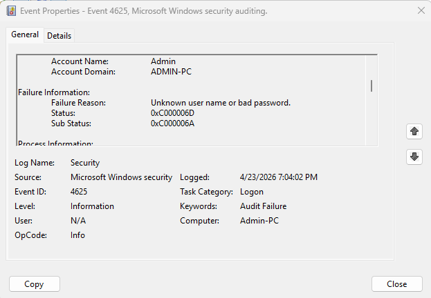
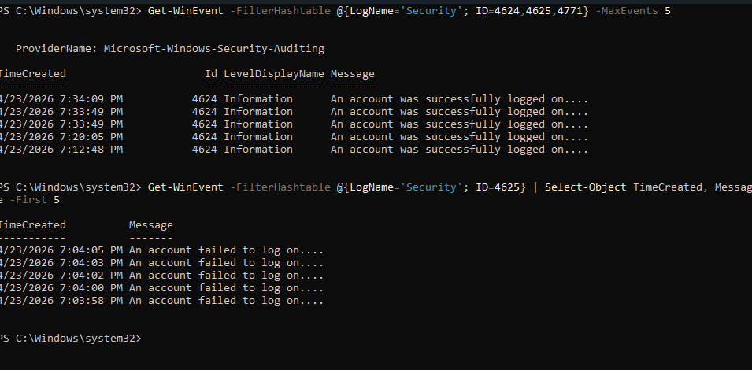

# Windows Failed Login Analysis

## Project Overview
I analyzed Windows Security Event Logs to identify failed authentication attempts (Event ID 4625). This project simulates a basic SOC investigation task — reviewing login failures for signs of brute force attacks.

## Tools Used
- Windows Event Viewer
- Windows PowerShell (Get-WinEvent)
- MITRE ATT&CK Framework

## What I Did
1. Generated 10+ failed login attempts by intentionally locking my screen and entering wrong passwords
2. Used Event Viewer to filter for Event ID 4625 (failed logons)
3. Examined timestamps, targeted usernames, and failure reasons
4. Identified source IP addresses (127.0.0.1 = localhost)
5. Documented findings in a structured report

## Key Findings

| Field | Value |
|-------|-------|
| Total failed logins analyzed | 5 events |
| Targeted account | Admin |
| Failure reason | 0xC000006A (wrong password) |
| Source IP | 127.0.0.1 (localhost) |
| Time pattern | 5 attempts in 7 seconds |
| Threat assessment | User error — not malicious |

## Event Timeline

| Event | Time | Account | Failure Reason | Source IP |
|-------|------|---------|----------------|-----------|
| 1 | 7:03:58 PM | Admin | 0xC000006A | 127.0.0.1 |
| 2 | 7:04:00 PM | Admin | 0xC000006A | 127.0.0.1 |
| 3 | 7:04:02 PM | Admin | 0xC000006A | 127.0.0.1 |
| 4 | 7:04:03 PM | Admin | 0xC000006A | 127.0.0.1 |
| 5 | 7:04:05 PM | Admin | 0xC000006A | 127.0.0.1 |

## Analysis Summary

**Why this is NOT a brute force attack:**
- Source IP 127.0.0.1 = localhost (attempts came from the same computer, not a remote attacker)
- Only 5 attempts total (brute force typically shows hundreds or thousands)
- Username "Admin" was consistent (no random username spraying)
- 7-second pattern matches human typing speed, not automated tools

**Why this IS user error:**
- Same account repeated (someone trying to log into their own account)
- Rapid retyping suggests frustration/wrong password
- No external IP addresses detected

## Screenshots

## MITRE ATT&CK Mapping

| Technique | ID | Application to This Case |
|-----------|-----|---------------------------|
| Brute Force | T1110 | Multiple failed authentication attempts observed |
| Valid Accounts | T1078 | Failed logins indicate attacker would need valid credentials first |

**Note:** While T1110 applies technically, the local source IP (127.0.0.1) makes this user error rather than adversarial activity. Context is critical in SOC analysis.

## Status Code Reference

| Code | Meaning |
|------|---------|
| 0xC000006A | Status_Wrong_Password (username exists, password incorrect) |
| 0xC0000064 | Status_No_Such_User (username does not exist) |
| 0xC0000071 | Status_Password_Expired |

## What I Learned

1. Event ID 4625 tracks failed login attempts with valuable forensic data (timestamp, username, status code, source IP)

2. Source IP is critical for threat assessment — 127.0.0.1 = local attempts, external IP = potential remote attack

3. Timestamps help distinguish user error (rapid attempts as user retypes) from automated brute force (consistent timing or mass volume)

4. Status code 0xC000006A specifically means "username correct but password wrong" — useful for troubleshooting

5. Not every security event is an incident. Context (source IP, frequency, volume) determines actual threat level.

## Full Report
- [Detailed Analysis Report](report.txt)

## Next Steps (Future Improvements)
- Set up auditing for specific high-value accounts
- Forward logs to a centralized SIEM (e.g., Splunk Free, Elastic)
- Create an alert rule for >10 failed logins in 2 minutes from external IP
- Investigate PowerShell alternative when Event Viewer is unavailable

## Author
Samrachana Baral
Date: April 23, 2026
